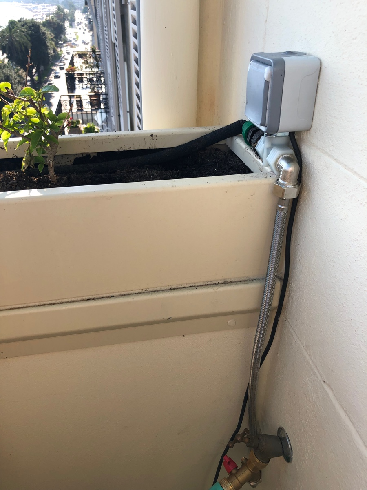

# home-assistant-watering
This is a low cost automatic watering system that is controlled by the open-source home automation platform [Home Assistant](https://home-assistant.io) that is triggered by a wireless (433.92Mhz) capacity soil moisture sensor.  The goal of this project is to provide you with the necessary configuration options to control your own selection of switches, valves and sensors.  My specific choices (which are proven to work well) may not be optimal for your personal situation.

This is a starting recipe for whatever watering dish you desire.

## Features
- Inexpensive!  Even if you have to buy everything, it's less than one of those "smart" valves.
- Fail safe - water can only flow while there is power and running software
- Water as needed - only waters soil falls below configured humidity level
- Water Only water within specific time window (user defined)
- Water at a controlled rate / frequency (user defined)
- Optional Logging and mobile alerts when run

## Challenges that inspired me to automate
- Hardiness zone 10 garden on balcony facing south
- Could only water before sunrise 
- Starting plants required above average attention and care
- Our particular plants do best when soil is allowed to dry
- Frequently away from home traveling
- Must water very slowly to minimize impact on neighbors and sidewalk below us
- Wanted to conserve as much water as possible

## How it works
1. The soil sensor reports soil humidity level (and air temp and battery power) approximately once every 10 minutes 24 hours a day, 365 days a year.  This is done wirelessly @433.92mhz up to 100 meters.  
2. The RFXtrx controller decodes the message and sends it via USB to the rfxtrx software component running in Home Assistant
3. The rfxtrx component reports new the new humidity (and temperature..) state on sensors defined in configuration
4. The new humidity state triggers the automation in Home Assistant 
5. The watering automation inspects the state of the soil, the time of day, the last time it watered, and decides if it's ok to "push" the water button switch which starts water flowing.
6. The zwave switch passes current to actuated pneumatic valve to "open" (spring otherwise holds close) allowing water to flow through to a long soaker hose.
7. After 10 minutes, water flow to soaker hose is shut off.  

Depending on soil absorption, hose type, water pressure, and so on - it might water for 10 minute increments for 2-3 hours.   It's all how you configure it.  For my balcony, most of the time it waters for ~ 20 minutes over 2 hours.  You could easily have it run once for an hour, or for 5 minutes, every hour.. and so on.

If you don't have a switch that automatically turns off (failsafe), you could easily have it turn the switch off after an arbitrary number of minutes by adding two more lines to the automation.

## Details on my environment
I have a south facing balcony garden in hardiness zone 10!  In the summer months watering is frequently required as it is sunny almost every day while in the winter months it rains quite a bit and is often cloudy.  In additi

that gets a LOT of sun a good portion of the year.  It was almost impossible to keep on top of watering and to make matters worse, we travel a lot.  

## Parts
- [Capacitive Soil moisture sensor](https://www.plantcaretools.com/product/wireless-soil-moisture-sensor/)
- [A switch](https://qubino.com/products/flush-1-relay/)
- [Directly actuated pneumatic valve](https://www.conrad.com/p/rpe-5105-nc-230vac-22-way-directly-actuated-pneumatic-valve-230-v-ac-g-12-583032)
- [An outdoor box](https://www.amazon.com/dp/B077Q9PBXG/ref=psdc_495308_t1_B012NJUUG4?th=1) (houses top of valve and zwave switch)
- [Soaker hose](https://www.amazon.com/Rocky-Mountain-Goods-Soaker-Hose/dp/B0763XVJ66/ref=sr_1_6?keywords=soaker+hose+25ft&qid=1570156270&sr=8-6_
- [RFXtrx 433.92mhz USB HA Controller](http://www.rfxcom.com/epages/78165469.sf/en_GB/?ObjectPath=/Shops/78165469/Products/18103) 
- [USB Z-wave controller stick](https://aeotec.com/z-wave-usb-stick/)

### Wireless Soil Sensor
You can use up to 3 Opus XT300 Soil Moisture sensors to have multiple zones (there is a jumper to set channel).  I calibrated mine by carefully submerging the probe (not the top!) in a glass of water to set it to max humidity, then dried it off before using.  I used rechargeable batteries in mine - it's been months and the battery is still considered to be at maximum.  There is a nice [FAQ](https://www.plantcaretools.com/product/wireless-moisture-monitor/) on the sensor.

It's worth noting you absolutely don't need the wireless moisture monitor - that's well within the purview of Home Assistant.

Why use 433Mhz?  The range is reall good (100 meters) without using much battery power and I had other equipment that was using this frequency so for me, the expense of the transceiver was not an issue.

### RFXtrx Tranceiver
The RFXtrx433XL USB HA controller from RFXCOM receives the wireless signal from soil sensor and translates it into something useable for the [rfxtrx](https://www.home-assistant.io/integrations/sensor.rfxtrx) component.  I already had mine for other projects, they are about $100 new last time I checked.

You will have to configure the transceiver using the RFXmngr (RFXmngrSetup.exe) software (Windows only).  Enable the XT300 protocol using the RFXmngr so that your soil sensor messages will be decoded and passed on to the rfxtrx component.  While running this software, it's also a good time to calibrate / test your soil sensor to make sure it's talking to transceiver.

If you use some other type of soil sensor, this tranceiver would not be required.

### Z-Wave switch
Z-wave is it's own thing and the only reason I went with z-wave for this switch is almost everything I have is.  The qubino relay switch I use has a really nice feature - an automatic shutoff.  This was important to me because I wanted to be sure if we ever lost power while it was watering.. or if my home automation server crashed.. **water-flow is stopped**

If that failsafe isn't important to you, I am sure you could find a much less expensive switch to do the job.

The device param configuration (changes from default):
- 1: Switch type is (0) - mono stable switch type
- 11: Automatic turning off output after (600) seconds (10 minutes) - you can adjust this as required.
- 30: Flush relay does not save power state after power failure (1)
- 40: (0) - reporting disabled.
- 42: (28800) - every 8 hours.

### Z-Wave Controller Stick
The [Z-Stick Gen5](https://aeotec.com/z-wave-usb-stick/) allows you to control z-wave devices.  In my case, this is required to control my z-wave switch.  If you go with some other kind of switch (e.g. wifi, zigbee, etc) this would not be required.

### Soaker Hose
This is my preferred method for watering most plants.

### Outdoor box
I cut a hole in the bottom the plastic housing and wired the switch inside letting the bottom of the pump stick out, so as to only protect wiring.  It's only purpose is to house the wiring and switch so they stay dry.

